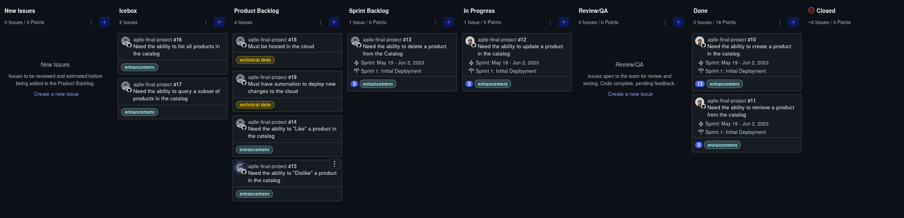
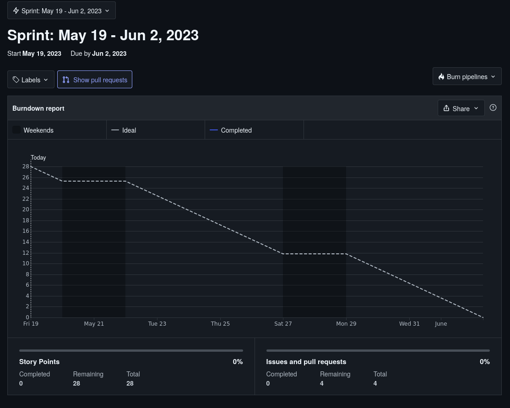

# Agile Final Project

This is the final project for "Introduction to Agile and Scrum" offered by IBM and part of the "DevOps and Software Engineering" specialization. These courses are offered through coursera.

This project emphasizes on:

- Creating a scrum project
- Famliarizing youself with the Kanban Board Workflow
- Working in sprints of two weeks
- Self-assigning user stories on the top of product backlogs during each sprint
- Getting to know the user story template, Gherkin syntax and user story assumptions and details

**Here is a project board on ZenHub**

**Here is a burndown chart**

